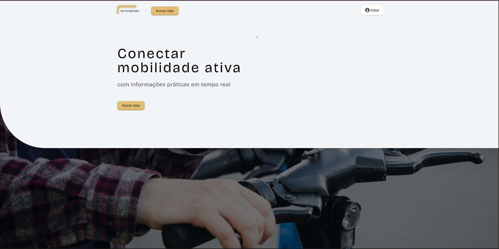
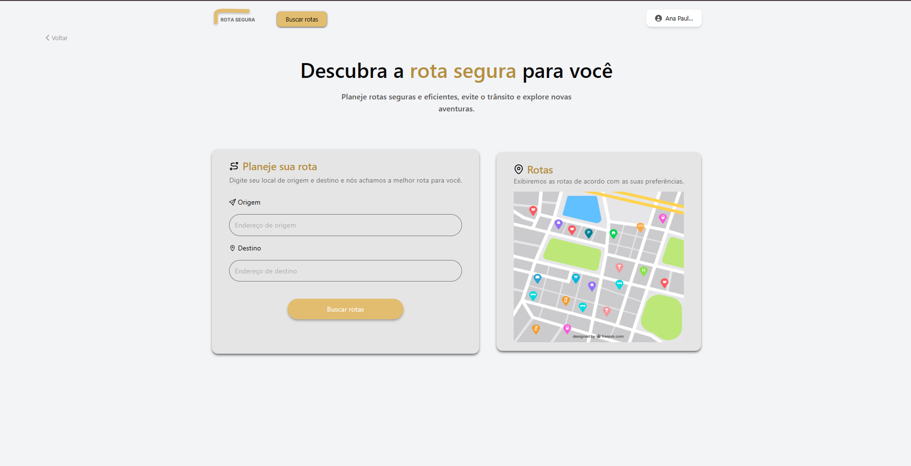
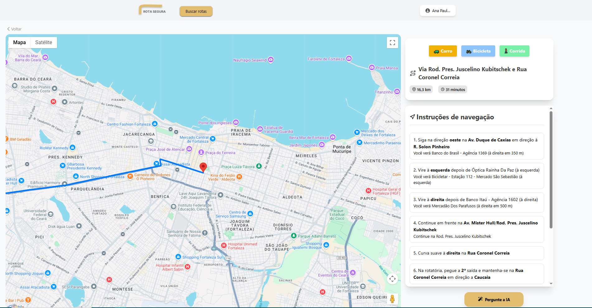
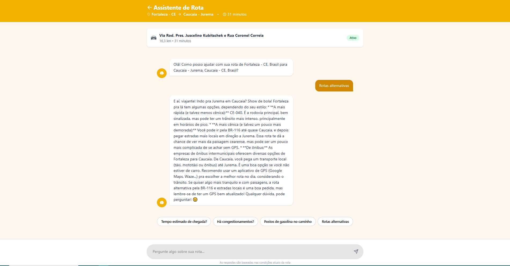

# 🚀 Rota Segura - Assistente Inteligente de Mobilidade Urbana

 

## 📖 Sobre o Projeto

O **Rota Segura** é uma aplicação web full-stack desenvolvida com o objetivo de oferecer uma solução completa e inteligente para o planejamento de rotas em ambientes urbanos.

A plataforma centraliza múltiplas funcionalidades, desde a busca de trajetos e comparação entre meios de transporte até um assistente com Inteligência Artificial (powered by Google Gemini) capaz de fornecer informações contextuais sobre a rota planejada.

---

## ✨ Funcionalidades Principais

* **Autenticação de Usuários:** Sistema completo de cadastro e login utilizando **JWT (JSON Web Tokens)** e Cookies para persistência de sessão.
  
* **Busca de Rotas com Alternativas:** Permite ao usuário buscar por um trajeto e receber múltiplas opções de rota, com um resumo de distância, duração e um mapa de pré-visualização para cada uma.
  
* **Página de Detalhes Interativa:** Ao selecionar uma rota, o usuário é direcionado para uma página dedicada com:
    * Um mapa ampliado e interativo com a rota traçada.
    * Instruções de navegação "curva a curva".
      
* **Troca Dinâmica de Modo de Transporte:** Na tela de detalhes, é possível alternar em tempo real entre os modos **Carro, Bicicleta e A Pé**, com a interface inteira (mapa, tempo, instruções) se atualizando dinamicamente.
  
* **Assistente com IA (Google Gemini):** Uma página de chat dedicada onde o usuário pode fazer perguntas sobre o destino ou trajeto (ex: "Onde há bicicletários perto do destino?", "Este caminho é seguro à noite?") e receber respostas geradas pela IA.

---

## 📸 Screenshots

| Tela de Busca                                       | Tela de Detalhes da Rota                                | Assistente de IA                                    |
| ----------------------------------------------------- | ------------------------------------------------------- | --------------------------------------------------- |
|  |  |  |

---

## 🛠️ Arquitetura e Tecnologias Utilizadas

O projeto foi desenvolvido com uma arquitetura de aplicação moderna, separando o Frontend do Backend.

### Backend

* **Linguagem/Ambiente:** Node.js
* **Framework:** Express.js
* **Arquitetura:** Padrão **MVC (Model-View-Controller)** para organização, separando `Routes`, `Controllers` e `Services`.
* **Banco de Dados:** MySQL
* **ORM:** Prisma, para uma interação segura e moderna com o banco de dados.
* **Autenticação:** `bcrypt.js` para hashing de senhas e `jsonwebtoken` para criação de tokens.
* **APIs Externas:**
    * **Google Maps Platform:** `Directions API` para cálculo de rotas.
    * **Google Generative AI:** `Gemini API` para o assistente de IA.

### Frontend

* **Biblioteca:** React.js
* **Roteamento:** React Router DOM
* **Formulário:** React Hook Form
* **Estilização:** Tailwind CSS, Headless UI, React Toastify
* **Comunicação com API:** Axios
* **Mapas:** Biblioteca `@react-google-maps/api` para integração com o Google Maps.

---

<h2> 💻 Autor</h2>

 
  
 <b>Ana Paula</b>

Feito por Ana paula 👋🏽 

 

