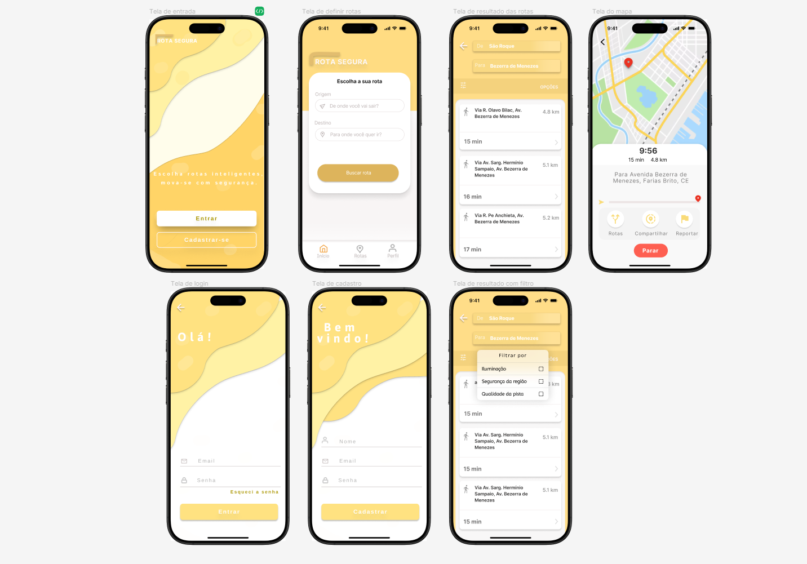

 <h1 align="center">Rota segura</h1>
 
 

  

> Criação própria do protótipo da aplicação Rota Segura, utilizando o Figma

  

## 🚀 Sobre o projeto

A aplicação irá mostrar rotas baseadas no local de origem e destino do usuario. Serão consumidas APIs para fazer a busca e o filtro das rotas.   

 

  ## 📝 Ajustes e melhorias
O projeto ainda está em desenvolvimento e as próximas atualizações serão voltadas nas seguintes tarefas:

- [ ] Desenvolvimento das telas
- [ ] Ligação com APIs

  

<h2> 💻 Autor</h2>

 
  
 <b>Ana Paula</b>

Feito por Ana paula 👋🏽 

 

